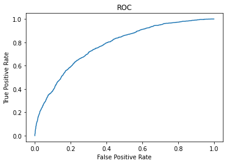
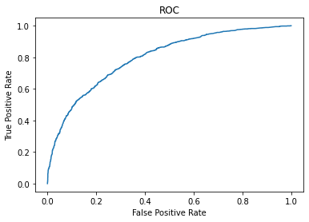
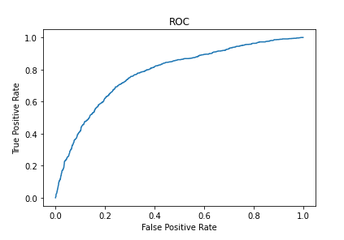
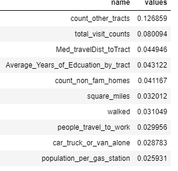

# ML Presentation

Team Choice: Classification

__Joshua Staples__

Model: GBT 

Accuracy: 75%

Precision: 83% (0's) 55% (1's)

F1-Score: 83% (0's) 55% (1's)

Does really good identifying 0's, barely better than a guess for 1's. 

Excluded the >100000 Income column.

ROC Curve:

__Kody Smith__

Model: GBT 

Accuracy: 77.2%

Precision: 0's: 78.56% 1's: 71.08%

F1-Score: 0's: 85.17%  1's: 52.52%

Excluded the >100000 Income column.

ROC Curve:

<!-- __Bryton Petersen__

Model: SVM Classifier

Accuracy:

Precision:

F1-Score:

 -->
 
 __Matthew Goodsell__
 
 Model: Random Forest Classifier
 
 Accuracy: 77.9%
 
 Excluded the >100000 Income column.
 

### Final Model

Random Forest Classifier with 77.9 accuracy

Model's parameters: 
- Number of trees set to 15
- Max Depth of the trees set to 15

Top ten most important Features

